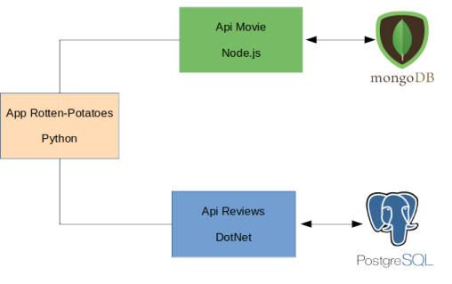

# Executando Projeto Rotten Tomatoes Microsserviços com Docker-Compose baseado em arquivo de enviroment

## Projeto
É baseado em uma aquitetura de Microsserviços e depende de mais 2 projetos pra funcionar

- [movie-ms]
- [resview-ms]

Segue abaixo o diagrama:

## Executando

$ docker-compose up -d

